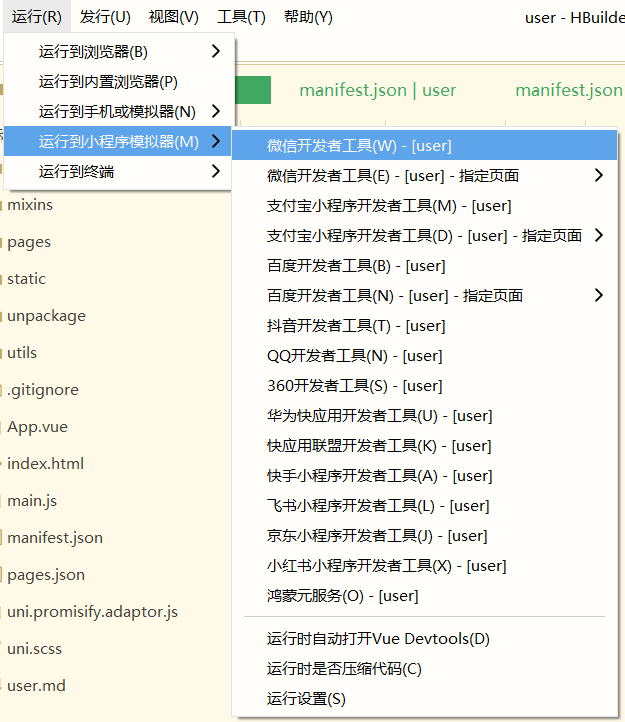

# Panda Scooter

<p align="center">
  
  
  
  
  
  
  
  
  
</p>

**Panda Scooter** is a full-stack shared scooter platform for riders, dispatchers, and administrators. The repository includes the backend service, three frontend applications, and the project documentation used for final handover and acceptance.

> This repository is organized for final project handover and acceptance.
> It includes the source code, database script, and documentation required for deployment and evaluation.

## 📦 Repository Contents

- `backend/` - Spring Boot backend project with shared modules and the main API service
- `frontend/admin/` - Vue 3 + Vite admin dashboard
- `frontend/dispatcher/` - uni-app dispatcher client
- `frontend/user/` - uni-app rider client
- `backend/bike_system.sql` - database initialization script
- `docs/` - design report, process materials, personal reports, screenshots, and acceptance notice

## ✨ Project Overview

The platform provides three main roles:

- **Riders** can find scooters on the map, unlock a scooter, and manage ride-related actions.
- **Dispatchers** can inspect operational data and handle dispatch workflows.
- **Administrators** can manage scooters, parking points, zones, and other operational data.

## 🧰 Tech Stack

> The stack is split into backend services, data infrastructure, map integration, and multi-client frontends.

- **Backend:** Spring Boot 3.2.x, Java 17, MyBatis, JWT, SpringDoc, MQTT
- **Database:** MySQL
- **Cache:** Redis
- **Object storage:** MinIO
- **Map service:** AMap JSAPI
- **Admin frontend:** Vue 3, Vite, Pinia
- **Rider and dispatcher clients:** uni-app

## 🧱 Project Structure

```text
Panda-Scooter
|-- backend
|   |-- panda-common
|   |-- panda-pojo
|   |-- panda-server
|   `-- bike_system.sql
|-- frontend
|   |-- admin
|   |-- dispatcher
|   `-- user
`-- docs
```

## ⚙️ Backend Modules

- **`backend/panda-common`** - shared constants, utilities, and common code
- **`backend/panda-pojo`** - entities, DTOs, and VOs
- **`backend/panda-server`** - Spring Boot application, controllers, services, persistence, and MQTT integration

## 🖥️ Frontend Apps

- **`frontend/user`** - rider app for login, map lookup, unlocking, and ride usage
- **`frontend/dispatcher`** - dispatcher app for map inspection and operational workflows
- **`frontend/admin`** - admin dashboard for parking point, zone, vehicle, and fleet management

## 📚 Delivery Materials

This repository is prepared for the final project handover and acceptance. It includes:

- **Source code** for all project modules
- **Database script** for initialization
- **Readme instructions** for setup and environment configuration
- **Design report** and process materials under `docs/`
- **Personal report materials** under `docs/`
- **Screenshot and presentation-related supporting files** where available

## 🧰 Prerequisites

- **Java 17**
- **Maven 3.9 or later**
- **Node.js 20.19+ or 22.12+**
- **npm**
- **MySQL 8**
- **Redis**
- **A running MQTT broker** if MQTT features are required
- **MinIO** if file storage features are required
- **AMap Web service credentials** for the admin map features

## 🛠️ Configuration

### 1. Database 🗄️

> The database script is included in the repository and should be imported before running the backend.

Import the database script:

```bash
backend/bike_system.sql
```

Then update the MySQL connection settings in:

```text
backend/panda-server/src/main/resources/application-dev.yml
```

> The development profile also contains Redis, mail, and MinIO settings.
> Adjust them to match your local environment.

### 2. Backend Runtime Settings 🔧

Backend runtime settings are defined in:

```text
backend/panda-server/src/main/resources/application.yml
```

Key items include:

- **Server port**
- **JWT settings**
- **MQTT connection settings**
- **Swagger UI path**

> If MQTT is not needed in your environment, disable it through the `panda.mqtt.enabled` setting or environment variables.

### 3. Admin Frontend Environment 🎨

The admin frontend uses Vite environment variables. Copy or update:

```text
frontend/admin/.env.example
frontend/admin/.env
```

Required values:

- **`VITE_AMAP_WEB_KEY`**
- **`VITE_AMAP_SECURITY_JS_CODE`**
- **`VITE_AMAP_JSAPI_VERSION`**

Optional values can be added for API base URLs and CDN overrides if needed.

### 4. Rider and Dispatcher API Environments 📡

The rider and dispatcher clients support mock, test, and production API environments in:

```text
frontend/user/api/env.js
frontend/dispatcher/api/env.js
```

> The default test endpoints point to the backend service address used by this project.
> Update them if you deploy the backend elsewhere.

## 🚀 Installation

### Backend ☕

```bash
cd backend
mvn clean install
```

> This installs the parent project and all backend modules.

### Admin Frontend 🖥️

```bash
cd frontend/admin
npm install
```

> Use the Vite environment files before running the admin client.

### Rider and Dispatcher Clients 📱

These clients are built with uni-app. Open `frontend/user` and `frontend/dispatcher` in a uni-app-compatible IDE, then install any required dependencies for your toolchain.

## ▶️ Run Locally

### Backend 🏗️

From the `backend` directory, run:

```bash
mvn -pl panda-server -am spring-boot:run
```

> The backend application listens on the port defined in `application.yml`, which is `8080` by default.

### Admin Frontend 🎛️

```bash
cd frontend/admin
npm run dev
```

### Rider and Dispatcher Clients 📲

Run each uni-app project from a uni-app-compatible IDE, such as **HBuilderX**, then build and run the project.



## 📝 Notes

> The repository is a multi-app system, so each frontend can be developed and deployed independently.
> Map-related features depend on a valid AMap key and the configured runtime environment.
> MQTT-based scooter communication depends on a reachable broker and the corresponding backend settings.
> Before final delivery, verify that the database, backend configuration, frontend environment variables, and external service credentials are all consistent.
