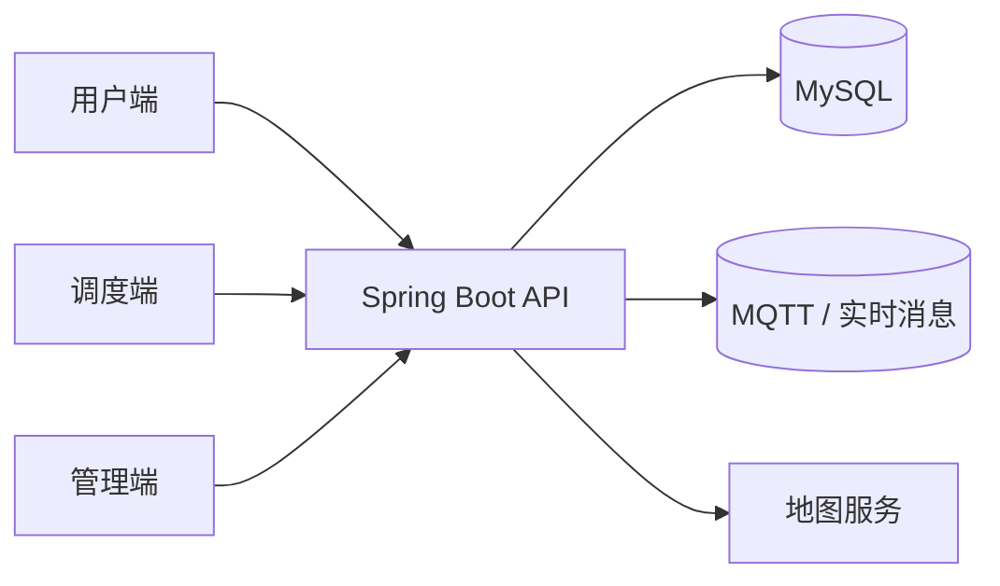
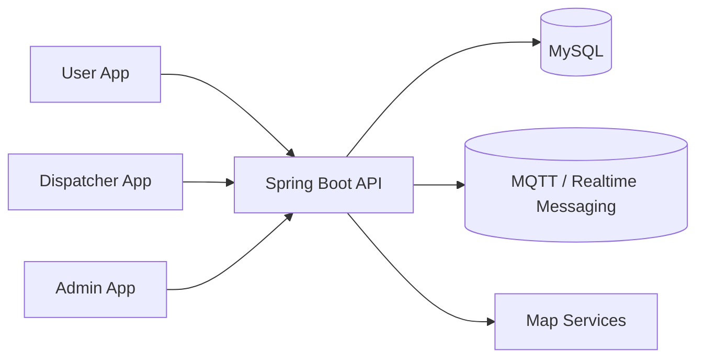

# Panda Scooter

<p align="center">
  
  
  
  
  
</p>

<p align="center">
  <a href="#chinese">简体中文</a> · <a href="#english">English</a>
</p>

---

<a id="chinese"></a>
## 简体中文

> 一个面向骑行用户、调度员和管理员的共享电单车全栈系统。

### ✨ 项目介绍

Panda Scooter 将骑行、调度和管理统一到一套系统中，支持地图找车、骑行流程、停车点管理、片区管理和车队监控。

### 🧩 项目结构

```text
Panda-Scooter
├── backend
│   ├── panda-common
│   ├── panda-pojo
│   └── panda-server
└── frontend
    ├── admin
    ├── dispatcher
    └── user
```

### 🖥️ 前端应用

- 🚀 `frontend/user` - 骑行端，支持登录、地图找车、解锁和骑行使用。
- 🧭 `frontend/dispatcher` - 调度端，支持地图查看和运营工作流。
- 🛠️ `frontend/admin` - 管理端，支持停车点、片区、车辆和调度管理。

### 🧠 后端模块

- 📦 `backend/panda-common` - 公共常量、工具类和共享代码。
- 🧱 `backend/panda-pojo` - 实体类、DTO 和 VO。
- ⚙️ `backend/panda-server` - Spring Boot 应用、控制器、服务和持久化逻辑。

### 🛠️ 技术栈

- ☕ 后端：Spring Boot 3.2.x、Java 17、MyBatis、JWT、SpringDoc、MQTT
- 🎨 管理端：Vue 3、Vite、Pinia、AMap JSAPI
- 📱 用户端和调度端：uni-app
- 🗄️ 数据库：MySQL

### 🔥 核心功能

- 🗺️ 基于地图的车辆和停车点查询
- 🔓 车辆解锁与骑行流程管理
- 🅿️ 停车点与禁停区管理
- 👥 片区与调度员分配管理
- 📊 管理端地图分层展示

### 🏗️ 架构示意



### 🖼️ 截图预留

你可以在这里补充项目截图，让 GitHub 首页更直观。

- 📷 用户端首页和地图
- 📷 调度端地图和运营视图
- 📷 管理端仪表盘和停车点编辑页

### 🚀 快速开始

#### 后端

```bash
cd backend
mvn spring-boot:run
```

#### 管理端

```bash
cd frontend/admin
npm install
npm run dev
```

#### 用户端 / 调度端

这两个应用基于 uni-app，进入对应目录后按项目常规方式运行即可。

### 📝 说明

- 🌍 地图展示依赖已配置的地图服务和环境变量。
- 🧩 本仓库是多端系统，各端可以独立开发和部署。

[返回顶部](#-panda-scooter)

---

<a id="english"></a>
## English

> A full-stack shared scooter platform for riders, dispatchers, and administrators.

### ✨ Overview

Panda Scooter combines rider operations, dispatch workflows, and admin management in one system. It supports map-based scooter discovery, ride lifecycle handling, parking point control, zone management, and fleet monitoring.

### 🧩 Project Structure

```text
Panda-Scooter
├── backend
│   ├── panda-common
│   ├── panda-pojo
│   └── panda-server
└── frontend
    ├── admin
    ├── dispatcher
    └── user
```

### 🖥️ Frontend Apps

- 🚀 `frontend/user` - Rider app for login, map lookup, unlocking, and ride usage.
- 🧭 `frontend/dispatcher` - Dispatcher app for map inspection and operational workflows.
- 🛠️ `frontend/admin` - Admin dashboard for parking point, zone, vehicle, and fleet management.

### 🧠 Backend Modules

- 📦 `backend/panda-common` - Shared constants, utilities, and common code.
- 🧱 `backend/panda-pojo` - Entities, DTOs, and VOs.
- ⚙️ `backend/panda-server` - Spring Boot application, controllers, services, and persistence logic.

### 🛠️ Tech Stack

- ☕ Backend: Spring Boot 3.2.x, Java 17, MyBatis, JWT, SpringDoc, MQTT
- 🎨 Admin frontend: Vue 3, Vite, Pinia, AMap JSAPI
- 📱 User and dispatcher frontends: uni-app
- 🗄️ Database: MySQL

### 🔥 Highlights

- 🗺️ Map-based scooter and parking point discovery
- 🔓 Scooter unlock and ride lifecycle tracking
- 🅿️ Parking point and no-parking area management
- 👥 Zone assignment and dispatcher management
- 📊 Layered map visualization on the admin side

### 🏗️ Architecture



### 🖼️ Screenshots

Add screenshots here to make the GitHub homepage more visual.

- 📷 User app home and map
- 📷 Dispatcher map and operational view
- 📷 Admin dashboard and parking point editor

### 🚀 Quick Start

#### Backend

```bash
cd backend
mvn spring-boot:run
```

#### Admin Frontend

```bash
cd frontend/admin
npm install
npm run dev
```

#### User / Dispatcher Frontends

These apps are built with uni-app. Open the corresponding directory in your uni-app workflow and run the project from there.

### 📝 Notes

- 🌍 Map behavior depends on the configured map provider and environment variables.
- 🧩 This repository is a multi-app system, so each frontend can be developed and deployed independently.

[Back to top](#-panda-scooter)
